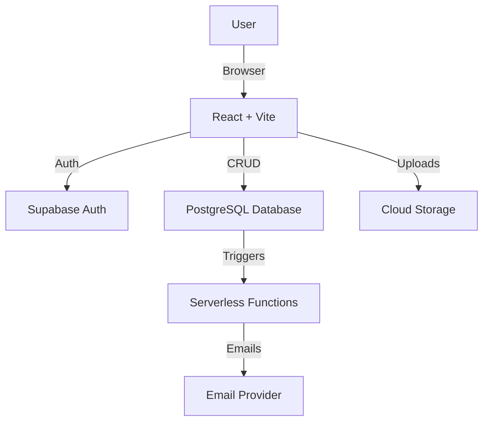

### Full-Stack Portfolio Website


A **production-ready full-stack portfolio website** designed to reflect **real-world engineering**, not just UI design.

This project is built with **scalability, performance, and maintainability** in mind.  
It features secure authentication, role-based access, real-time content updates, cloud storage, email automation, and a fully functional admin-controlled CMS.

---

## 📌 Table of Contents

- [Live Demo & Repository](#-live-demo--repository)
- [Screenshots](#-screenshots)
- [Features](#-features)
  - [Authentication & Authorization](#-authentication--authorization)
  - [Database & Content Management](#-database--content-management)
  - [Storage & Real-Time Updates](#-storage--real-time-updates)
  - [Blog Platform](#-blog-platform)
  - [User Experience](#-user-experience)
- [Tech Stack](#-tech-stack)
- [Project Structure](#-project-structure)
- [System Architecture](#-system-architecture)
- [Installation & Setup](#-installation--setup)
- [Environment Variables](#-environment-variables)
- [Security Highlights](#-security-highlights)
- [Build Your Own Portfolio](#-build-your-own-portfolio)
- [Support](#-support)

---

## 🌐 Live Demo & Repository

🌐 **Live Website:** https://sharmag02.netlify.app  
🐙 **GitHub Repository:** https://github.com/sharmag02/sharmag02

---

## 📸 Screenshots

### Homepage


### Admin Dashboard


### Blog System


### Certifications Page


### Login & Signup


### Password Reset


---

## 🚀 Features

### 🔐 Authentication & Authorization
- Secure authentication using Supabase Auth
- Role-based access control (**Admin / User**)
- Protected routes to prevent unauthorized access
- Password reset and recovery flow

### 🗄️ Database & Content Management
- Centralized PostgreSQL database for:
  - Blogs
  - Projects
  - Skills
  - Experience
  - Certifications
- Fully functional **Admin Panel** for managing content
- CRUD operations without redeploying the frontend
- Rich text editing using **CKEditor**

### ☁️ Storage & Real-Time Updates
- Cloud storage for images and certificates
- Real-time updates across the website using Supabase
- Instant reflection of admin changes on the public site

### 📝 Blog Platform
- SEO-friendly blog slugs
- Like and comment system
- Subscriber-based email notifications for new blog posts
- Clean reading and authoring experience

### 🎨 User Experience
- Fully responsive design across devices
- Dark / Light theme support
- Smooth UI interactions and animations
- Performance-focused frontend architecture

---

## 🧠 Tech Stack

### Frontend
- React
- Vite
- TypeScript
- Tailwind CSS
- Framer Motion

### Backend (BaaS)
- Supabase
  - Authentication
  - PostgreSQL Database
  - Storage
  - Row Level Security (RLS)

### Email & Automation
- Serverless functions
- Email service integration for notifications

### Deployment
- Cloud-hosted
- Production-ready environment

---

## 📁 Project Structure

```txt
src/
├── TestEmail.tsx
│
├── app/
│   ├── App.tsx                 # Root application component
│   ├── main.tsx                # Application entry point
│   └── ProtectedRoute.tsx      # Route-level access control
│
├── ckeditor/
│   └── CustomEditor.ts         # CKEditor configuration & customization
│
├── features/
│   ├── admin/
│   │   ├── AdminPanel.tsx      # Admin dashboard UI
│   │   └── AdminUtils.ts       # Admin utility functions
│   │
│   ├── auth/
│   │   ├── AuthTabs.tsx        # Login / Signup switch
│   │   ├── ForgotPassword.tsx
│   │   ├── Login.tsx
│   │   ├── ResetPassword.tsx
│   │   └── Signup.tsx
│   │
│   ├── blog/
│   │   ├── BlogAdminHelpers.ts
│   │   ├── BlogDetail.tsx
│   │   ├── BlogList.tsx
│   │   ├── BlogSubscribe.tsx
│   │   └── editor/
│   │       └── BlogEditor.tsx
│   │
│   ├── certifications/
│   │   ├── CertificationAdminHelpers.ts
│   │   ├── CertificationList.tsx
│   │   └── editor/
│   │       └── CertificationEditor.tsx
│   │
│   ├── experience/
│   │   ├── ExperienceAdminHelpers.ts
│   │   ├── ExperienceList.tsx
│   │   ├── ExperienceTimeline.tsx
│   │   └── editor/
│   │       └── ExperienceEditor.tsx
│   │
│   ├── projects/
│   │   ├── ProjectAdminHelpers.ts
│   │   ├── ProjectList.tsx
│   │   └── editor/
│   │       └── ProjectEditor.tsx
│   │
│   ├── sections/
│   │   ├── About.tsx
│   │   ├── Blog.tsx
│   │   ├── Certifications.tsx
│   │   ├── Contact.tsx
│   │   ├── Experience.tsx
│   │   ├── Home.tsx
│   │   ├── Projects.tsx
│   │   └── Skills.tsx
│   │
│   └── skills/
│       ├── SkillAdminHelpers.ts
│       ├── SkillList.tsx
│       └── editor/
│           └── SkillEditor.tsx
│
├── shared/
│   ├── components/
│   │   ├── Header.tsx
│   │   ├── Loader.tsx
│   │   ├── MobileNav.tsx
│   │   ├── NextPageArrow.tsx
│   │   ├── Sidebar.tsx
│   │   ├── ThemePopup.tsx
│   │   └── ThemeToggle.tsx
│   │
│   ├── config/
│   │   └── routeFlow.ts        # Central route configuration
│   │
│   ├── context/
│   │   ├── AuthContext.tsx
│   │   └── ThemeContext.tsx
│   │
│   ├── lib/
│   │   ├── supabase.ts         # Supabase client setup
│   │   └── SupabaseUploadAdapter.ts
│   │
│   ├── types/
│   │   └── database.ts         # Database type definitions
│   │
│   └── utils/
│       ├── extractImagePaths.ts
│       └── slugify.ts
│
└── styles/
    ├── editor.css
    └── index.css
```

## 🏗️ System Architecture


--- 

### ⚙️ Installation & Setup (FIXED)

```md


```bash
# Clone the repository
git clone https://github.com/sharmag02/sharmag02.git

# Install dependencies
npm install

# Start development server
npm run dev

```

---

### 🔑 Environment Variables (FIXED)

```md


Create a `.env` file in the root directory:

```env
VITE_SUPABASE_URL=your_supabase_url
VITE_SUPABASE_ANON_KEY=your_supabase_anon_key

```

---

### 🔐 Security Highlights (FIXED)

```md


- Row Level Security (RLS) enabled in Supabase
- Admin-only database operations
- Secure environment variable handling
- Serverless functions for sensitive logic
```
## 🐙 Build Your Own Portfolio

Want to create your own **production-ready portfolio**?

1. Fork this repository  
2. ⭐ Star it if you find it useful  
3. Customize content via the admin panel  
4. Deploy and make it yours  

For help or guidance, feel free to reach out via **LinkedIn DM**:  
👉 https://linkedin.com/in/sharmag02


## ⭐ Support

If this project helped you:

- Star the repository
- Fork it
- Share feedback or suggestions


